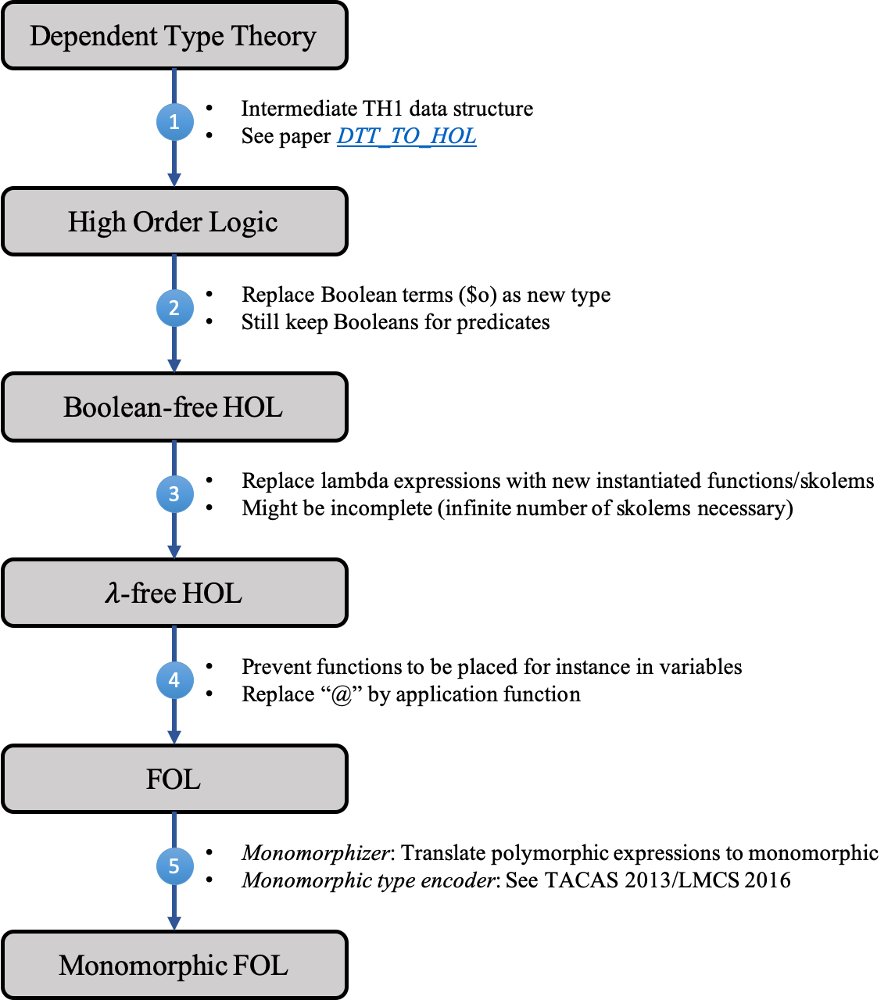

# Lean hammer
Development repository of a Lean hammer. For details, please have a look at the [documentation](documentation/lean_hammer_documentation.pdf).

This project has been developed at the Vrije Universiteit Amsterdam (2018-2019) in terms of the [Lean Forward project](https://lean-forward.github.io) (student research assistant position), under the supervision of [Jasmin Blanchette](https://cs.vu.nl/~jbe248/) and Robert Lewis.

## File structure for FOL specific translation
* [_leanhammer.lean_](leanhammer.lean): Main file combining all functions for testing
* [_problem_translation.lean_](problem_translation.lean): Summarizes the steps for translating a problem into FOF. Note that this file should be independent of the actual encoding of the first-order logic.
* [_premise_selection.lean_](premise_selection.lean): Implementation of strategies for selecting the most relevant premises/axioms. Might be moved into C/C++ code for performance gain. 
* [_import_export.lean_](import_export.lean): Handling functions for the import and export of files (communication to first-order provers)

Next to the general files, there are several functions that directly interact with the underlying FOF encoding. The following encodings are supported and implemented:

### TPTP encoding
* [_tptp.lean_](tptp/tptp.lean): Summarizes data structures for simple first-order formula and their representation in the TPTP format
* [_translation_tptp.lean_](tptp/translation_tptp.lean): Functions for translating expressions into FOF. This include the hammer functions _F_, _C_ and _G_. 
* [_simplification_tptp.lean_](tptp/simplification_tptp.lean): Simplification functions for TPTP encoded first-order formula 

### TF0 encoding
Typed first-order form. Coming soon...

## Generalized version
Details are outlined in the [documentation](documentation/lean_hammer_documentation.pdf).

  

